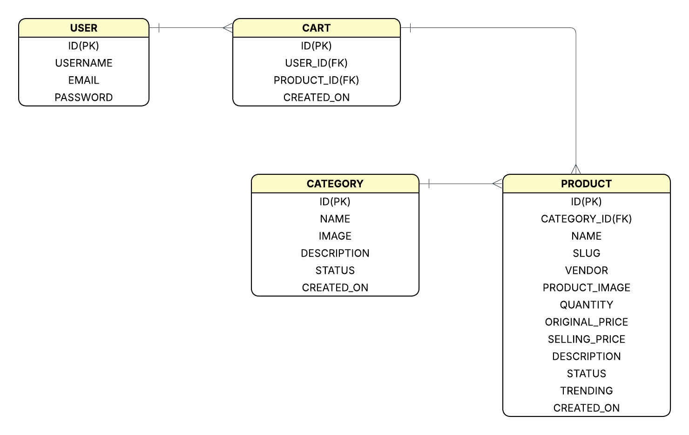
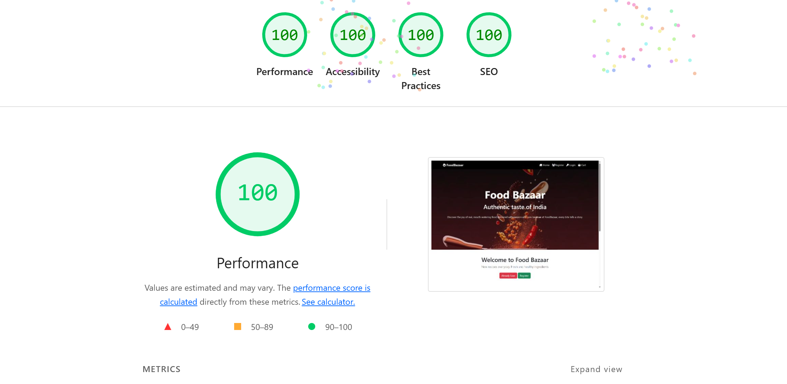
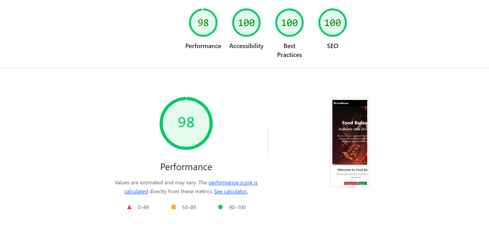
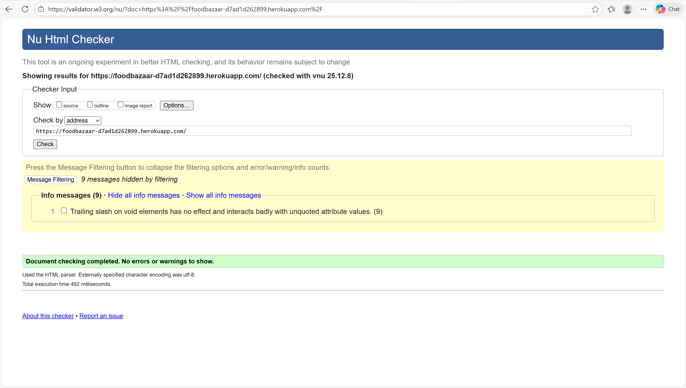
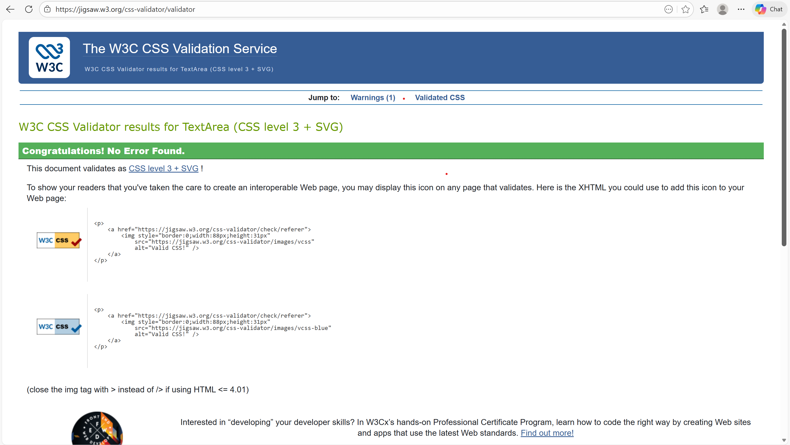
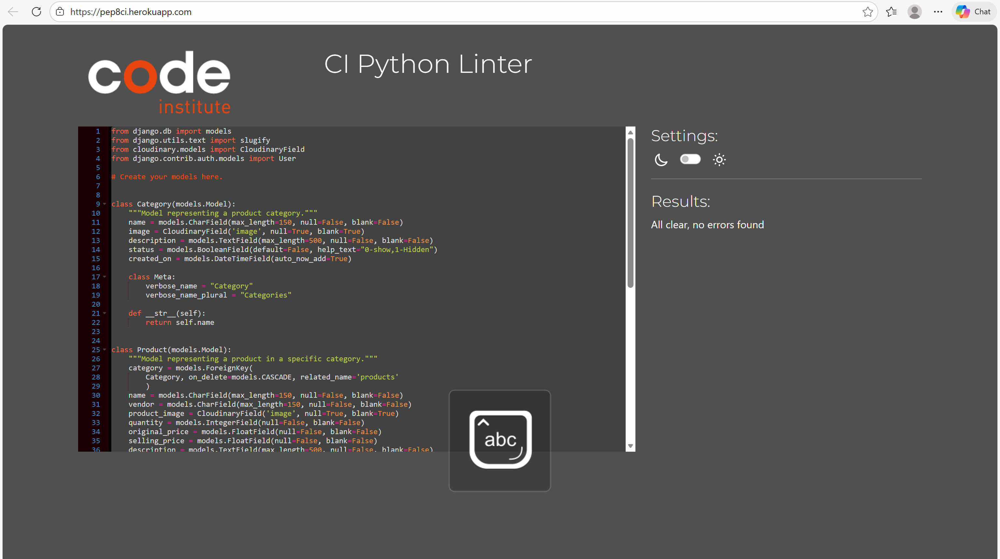
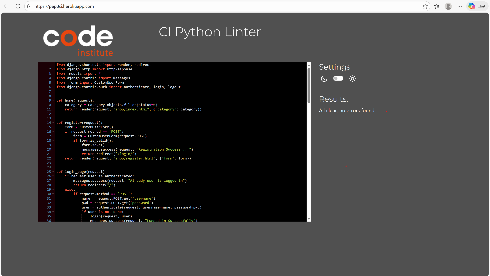
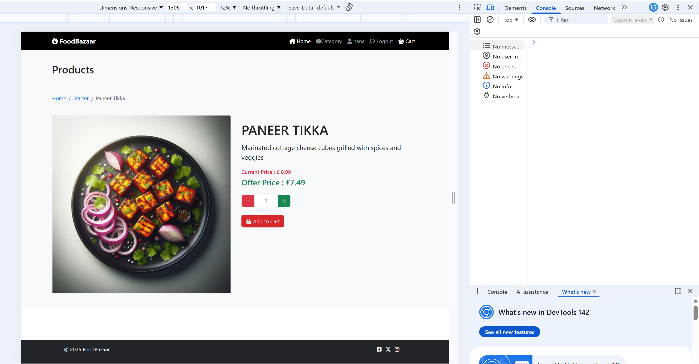

# Food Bazaar

## Overview
FoodBazaar is a Django-powered web application designed to deliver a seamless online food shopping experience. The back end is built with Python and Django, while the front end uses HTML, CSS, JavaScript, and Bootstrap 5.

The platform allows users to browse products by category, view detailed product information, and manage their shopping cart by adding, updating, or removing items. It features a responsive and intuitive interface enhanced with interactive modals and dynamic alerts to ensure smooth user interactions.

Although the checkout system is still under construction, FoodBazaar already provides users with an efficient and engaging shopping experience. By combining clean design with user-friendly functionality, the platform helps users explore products easily and enjoy a pleasant, accessible online shopping journey.

## Table of Contents

- [Overview](#overview)
- [UX Design](#ux-design)
  - [User Stories](#user-stories)
  - [Wireframes](#wireframes)
  - [ERD](#erd)
  - [Colours](#colours)
  - [Font](#font)
- [Key Features](#key-features)
  - [User Authentication & Management](#user-authentication--management)
  - [Category Based Product Browsing](#category-based-product-browsing)
  - [Shopping Cart Management](#shopping-cart-management)
  - [Admin Panel Stock & Product Management](#admin-panel-stock—product-management)
  - [Responsive Design](#responsive-design)

- [Deployment](#deployment)
- [AI Implementation & Orchestration](#ai-impelementation--orchestration)
- [Testing](#testing)
  - [Desktop Lighthouse Reports](#desktop-lighthouse-reports)
  - [Mobile Lighthouse Reports](#mobile-lighthouse-reports)
  - [HTML Validation](#html-validation)
  - [CSS Validation](#css-validation)
  - [Python Validation](#python-validation)
  - [JavaScript Validation](#javascript-validation)
  - [Manual Testing](#manual-testing)
 
- [Future Enhancements](#future-enhancements)
- [Agile](#agile)
- [Credits](#credits)

## UX Design

### User Stories

The user stories for the FoodBazaar application have been carefully crafted to ensure the development process remains user-centered and focused on delivering a seamless and engaging online food shopping experience. These stories serve as the foundation for feature development, testing criteria, and project prioritization.

**User Story 1: Navigation**

As a visitor, I can navigate the site easily so that I can browse without confusion.

**Acceptance Criteria:**
- Given a visitor is on the website, they can access the menu/navigation bar.
- Given a visitor clicks any navigation link (Home, Products, Cart, Login), they are taken to the correct page.
- Given a visitor is browsing, they can return to the previous page easily using visible navigation options.

**User Story 2: Product List**

As a visitor, I can view the category, product list and product details so that I can explore items to purchase. 

**Acceptance Criteria:**
- Given a visitor is on the category list page, they can see all visible and active categories.
- Given a visitor clicks on a category name, they can view all visible and active products(status=0) within that category.
- Given a product is hidden or inactive(status=1), it should not appear in any product list or category page for the visitor.

**User Story 3: Registration,Login,Logout**

As a logged-in user, I can register, log in, and log out so that I can access user-only features.

**Acceptance Criteria:**

- Given a new visitor, they can register a new user account.
- Given a registered user, they can log in using valid credentials.
- Given a logged-in user, they can log out from any page.

**User Story 4: Product management in admin panel (CRUD)**

As an admin, I can create, view, update, and edit categories and products from the admin panel so that I can effectively manage the store inventory and organize products.

**Acceptance Criteria:**
Category Management
- Given an admin is logged in, they can create a new category.
- Given an admin is logged in, they can view all existing categories in the admin panel.
- Given an admin is logged in, they can update/edit category details (name, description, status).
Product
- Given an admin is logged in, they can create a new product.
- Given an admin is logged in, they can read/view existing products in the admin panel.
- Given an admin is logged in, they can update/edit any product details.

**User Story 5: Manage cart items (update & delete)**

As a logged in user, I can edit the number of products in my cart, remove products so that I can manage my order.

**Acceptance Criteria:**

- Given a logged-in user, they can increase or decrease the quantity of a product(e.g., using “+” and “–” buttons)
- Given a logged-in user, they can add items in their cart by Add to Cart button .
- Given a product is out of stock, then the Add to Cart button is hidden .
- Given a logged-in user, they can view items in their cart.
- Given a logged-in user, they can remove a product from the cart.

**User Story 6:Checkout(should-have)**

As a logged-in user,I want to provide payment/shipping information,
So that I can successfully complete my purchase.

**Acceptance Criteria:**

- Given a logged-in user is on the checkout page,When they enter valid payment details,
Then the information is accepted and stored securely.
- Given a logged-in user is on the checkout page,When they enter valid shipping details,
Then the information is accepted and used for order fulfillment.
- Given a logged-in user has entered valid payment and shipping information,When they click “Place Order”,
Then the order is confirmed and saved in the database,And a confirmation message is displayed.

## Wireframes

The wireframes for the Food Bazaar application were created using Balsamiq Wireframes to visualize the user interface design and layout before development. These wireframes helped establish the information architecture, user flow, and responsive design considerations for desktop ,iPad and mobile experiences. 

- [desktop,iPad and mobile](Readme/fb_wireframe.png) wireframes for FoodBazaar

## ERD

The Entity Relationship Diagram (ERD) for the Food Bazaar application was created using LucidChart to provide a clear visual representation of the database structure and relationships. This diagram serves as a crucial design document that illustrates how data is organized and connected within the application.

## Colours

The following colours are the main colours used in the Food Bazaar

## Font

I used Open Sans as the primary font. Open sans creates a clean, modern and highly readable interface that aligns with the calming and positive nature of the Food Bazaar application. The font weights are varied throughout the project for headings and subheadings.

# Key Features

## User Authentication & Access Control
Food Bazaar provides a secure and reliable authentication system that enables users to create accounts, log in with valid credentials, and maintain authenticated sessions throughout their shopping experience. The registration process captures essential user details and stores them safely, while the login system ensures only verified users gain access to personalized features. Logout functionality is implemented to securely end sessions and protect user data on shared devices. This authentication layer forms the foundation for all user-specific actions within the platform.

## Category-Based Product Browsing
The platform includes a well-structured category management system that helps users browse products with ease. Each category such as Starter, Dessert, and Meal—displays all products associated with it, allowing users to quickly navigate through the menu. When a user clicks on a category, they see the relevant products, and selecting a specific product opens its detailed view, where they can learn more and add it to their cart.

This organized layout improves product discoverability and ensures customers can find what they’re looking for without searching through the entire inventory.

## Shopping Cart Management
Food Bazaar includes an intuitive shopping cart system accessible to all authenticated users. Logged-in users can add products to their cart directly from category pages. The cart interface provides clear details such as product name, quantity, and price, allowing users to review their selections before checkout. Users can also remove items from their cart at any time, giving them full control over their shopping choices before making a purchase.

## Admin Panel Stock & Product Management
A dedicated admin panel empowers administrators to manage the entire stock system seamlessly. Admins can add new products, update existing ones, adjust quantities, and categorize items to keep the marketplace organized and up-to-date. The stock management module ensures real-time visibility of available inventory, preventing stockouts and keeping product listings accurate for users. This robust backend control supports consistent and efficient operations across the platform.

## Responsive Design

For the most part, utilising the [Bootstrap Framework](https://getbootstrap.com/docs/5.3/getting-started/introduction/) allowed me to implement a responsive design fairly easily.

Here is what the website looks like on different screens:

## Desktop

- [Desktop Responsiveness](Readme/fb_deskresponse.png)

## iPad

- [Ipad Responsiveness](Readme/fb_ipadresponse.png)

## Mobile

- [Mobile Responsiveness]( Readme/fb_mobileresponse.png)

# Deployment

The Food Bazaar application was deployed to Heroku using a systematic approach that ensures production-ready performance and security. The deployment process began with configuring the Django settings to handle both development and production environments seamlessly.

**Environment Configuration:** The project uses environment variables to manage sensitive information and configuration settings. Database credentials, secret keys, and other sensitive data are stored as Heroku config vars rather than being hardcoded in the application files. This approach maintains security while allowing the application to adapt to different deployment environments.

**Database Setup:** The application transitions from SQLite for local development to PostgreSQL for production on Heroku. This change provides better performance, reliability, and scalability for the live application. The database configuration automatically detects the environment and uses the appropriate database backend.

**Cloudinary Integration for Media Storage:**
The project is configured to use Cloudinary as the primary storage service for all admin-uploaded media, including category and product images. This setup provides scalable, reliable, and globally optimized hosting without relying on local file storage. All Cloudinary credentials and configuration settings are securely managed using environment variables in both the local .env file and Heroku Config Vars, preventing sensitive information from being hardcoded or exposed in version control. Since only administrators can upload images through the Django admin panel, all uploaded media is automatically stored in Cloudinary, and the generated optimized URLs are seamlessly served throughout the application for consistent and reliable media delivery.

**Static File Management:** Static files are handled using WhiteNoise middleware, which was specifically configured to serve CSS, JavaScript, and image files efficiently in production. This eliminates the need for a separate static file .

**Production Settings:** The deployment includes production-optimized settings such as proper ALLOWED_HOSTS configuration, debug mode disabled, and secure static file serving. The STATICFILES_DIRS configuration was carefully adjusted to work with Heroku's file system structure, ensuring all custom CSS and JavaScript files are properly served.

**Deployment Process:** The application is deployed using Git integration with Heroku, allowing for easy updates and version control. Dependencies are managed through the requirements.txt file, ensuring all necessary packages are installed in the production environment. The deployment includes automatic dependency installation and database migration execution.

<a href="#food-bazaar">Back To Top</a>

# AI Implementation & Orchestration

I leveraged artificial intelligence as a comprehensive development partner throughout the entire project lifecycle. AI served as an intelligent coding assistant, providing expert guidance on Django best practices, debugging complex issues, and optimizing code structure for maintainability and performance.

**Code Development & Architecture:** AI assistance was instrumental in structuring the Django application architecture, helping to design efficient models, views, and URL patterns.

**Problem-Solving & Debugging:** Throughout development, AI served as a debugging partner, helping to identify and resolve issues with static file serving, database migrations, and deployment configurations. 

**Documentation & Best Practices:** AI assisted in creating comprehensive documentation, including the detailed user stories with acceptance criteria, technical specifications, and deployment procedures. The AI helped ensure that the project documentation follows professional standards and provides clear guidance for future development.

**Deployment Optimization:** During the Heroku deployment process, AI provided guidance on production settings, environment variable configuration, and static file management. This collaboration resulted in a robust, scalable deployment that handles both development and production environments seamlessly.

**AI Limitations:** Although AI was a powerful tool in the development of the Food Bazaar application, its usage had some drawbacks including providing incorrect solutions as well as advising of unnecessary steps.

# Testing

I tested the application on my windows laptop and on iPad to see if there were any bugs that needed to be fixed. I also tested the application on iPhone.

Furthermore, I ran lighthouse tests using chrome developer tools to obtain scores for the pages' performance, accessibility and best practices. I tested for both the desktop and mobile pages. 

## Desktop Lighthouse Reports

- Lighthouse report for the [login page](Readme/fb_login_lighthousescore.png) of the website.

- Lighthouse report for the [product page](Readme/fb_product_lighthousescore.png) of the website.

## Mobile Lighthouse Reports

## HTML Validation

**Fully Passed W3C Validation** - both HTML & CSS passed official W3C validators with no issues, ensuring clean and compliant code.

## CSS Validation

## Python Validation

Code Institute's Python Linter was used. All python files has no errors.

## Javascript Validation

I used devtool to validate my javascript. There were no errors to show. 

## Manual Testing

The application was tested manually to make sure user authentication and CRUD functionality were working. I also tested the accessibility and the responsiveness to different screen sizes. I found everything to be working fine.

**Manual testing screenshots:**
- [login success message](Readme/login_success.png)
- [logout success message](Readme/logout_success.png)
- Show a [please login to shop ](Readme/login_to_shop.png)message when a visitor clicks the **AddToCart** button
- Show a [please login to view your cart ](Readme/login_to_view_cart.png)message when a visitor clicks the **Cart** in the navbar
- [Out of stock](Readme/out_of_stock.png)
- [Product added to the cart](Readme/product_added.png)
- [Cart item quantity updated](Readme/cart_quantity_updated.png) Item (Chicken Biryani) quantity **updated** from 1 to 2
- [Cart item remove request](Readme/cart_item_delete.png)
- [Cart item removed](Readme/cart_item_removed.png) Item (Chicken Biryani) **removed** from the cart
 

# Future Enhancements
- Search Bar Enhancements
- Voice Search Product Enhancements
- Payment Process Enhancements
- Customer Review Enhancements

# Agile

- Project managed using agile principles: iterative development, regular review, and adaptation.
- User stories and MoSCoW prioritisation guided feature development.
- Kanban board (Trello/Jira/other) used for task tracking.

# Credits

I would like to credit Code Institute's project. I would also like to credit ChatGPT for code generation and its amazing assistance throughout the project.

**Acknowledgements**

-	Inspiration taken from previous projects shared with us by Code Institute

**Content**

-   Some text content was generated using AI.
-   The icons were taken from Font Awesome.

**Media**

-   The hero image and product images were generated by [Bing Image Creator] (https://www.bing.com/images/create/) 

<a href="#food-bazaar">Back To Top</a>

